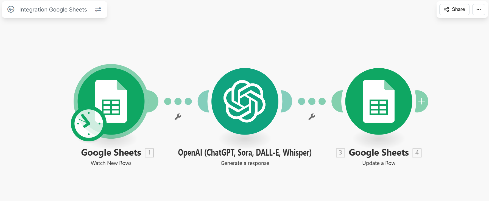

# AI Customer Feedback Sentiment Analyzer

AI-powered customer feedback sentiment analysis using Make.com and OpenAI (gpt-4o-mini).

---

## 🔍 What It Does
- Watches new customer feedback added to Google Sheets
- Uses AI to classify sentiment (Positive / Negative)
- Generates a concise 5-word summary
- Writes the AI analysis back into the same Google Sheet row automatically

---

## 🛠 Tools Used
- Make.com (No-code automation)
- Google Sheets
- OpenAI API (gpt-4o-mini)

---

## ⚙️ Workflow
1. Google Sheets triggers when a new row is added
2. Customer feedback text is sent to OpenAI
3. AI analyzes sentiment and generates a short summary
4. Results are written back to Google Sheets

---

## 🧪 Example

## 📸 Screenshots

### Make.com Scenario

---

## 🚀 How to Recreate
1. Create a Google Sheet with columns:
   - Customer Feedback
   - AI Analysis
2. Build a Make.com scenario:
   - Google Sheets → Watch New Rows
   - OpenAI → Create Chat Completion (gpt-4o-mini)
   - Google Sheets → Update a Row
3. Add your OpenAI API key inside Make.com
4. Run the scenario

---

## 🔒 Security Notes
- No API keys or credentials are stored in this repository
- OpenAI API key must be added directly in Make.com

---

## 👤 Author
Md Abdul Bari
